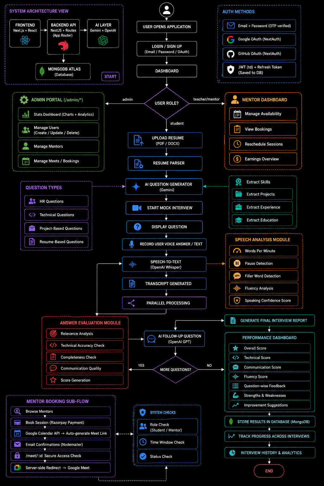

# Ace AI — AI-Powered Interview & Mentorship Platform



## 🌐 Live Demo
- **App**: [https://aceai.sumitksr.xyz](https://aceai.sumitksr.xyz)

---

## 📖 Overview

**Ace AI** is a full-stack interview preparation and mentorship platform. It combines adaptive AI mock interviews, deep resume intelligence, a mentor booking system, and a full admin control panel — all in one workspace.

Candidates can practice AI-driven mock interviews, get resume feedback, and book 1-on-1 sessions with real mentors. When a session is booked, a **Google Meet link is automatically generated** and saved to the booking. At session time, participants visit a secure link that validates their identity and time window, then redirects them directly into Google Meet.

---

## ✨ Feature Suite

### 🎙️ AI Mock Interviews
- **Context-aware questioning** — adapts to your resume, target role, and previous answers
- **Multi-modal input** — type answers or use your microphone (speech-to-text via Whisper)
- **AI follow-up questions** — dynamically generated after each answer
- **Instant feedback** — STAR method scoring, technical accuracy, behavioral analysis
- **Reuse previous interview** — continue where you left off with previous question sets

### 📄 Resume Intelligence
- **ATS keyword analysis** — matches your resume against a target job description
- **Impact rewriting** — detects weak bullet points and suggests action-verb rewrites
- **Interview-resume synergy** — connects your resume claims to your interview answers

### 📊 Candidate Dashboard
- Performance trends across Clarity, Technical Depth, Confidence, and Communication
- Prioritised "Next Steps" after every session
- Historical session transcripts and evaluation playback

### 👥 Mentor Booking System
- Browse and book verified mentors for 1-on-1 interview sessions
- Payment via **Razorpay** (free and paid sessions supported)
- **Google Meet auto-generated** at booking time — no manual link sharing needed
- Mentor can reschedule sessions from their dashboard
- Automated email confirmations to both student and mentor

### 🔒 Secure Meeting Access (`/meet/:bookingId`)
All session access is validated server-side before any redirect:
- ✅ User must be authenticated
- ✅ User must be the booked student **or** the mentor for that session
- ✅ Current time must be within the session window (opens 30 min before, expires 1 hr after end)
- ✅ Session status must be `confirmed` or `pending` (not `cancelled` or `completed`)
- ✅ Google Meet URL is **never exposed to the browser** — server-side `redirect()` only

### 🛡️ Admin Portal (`/admin/*`)
A dedicated admin control panel with its own sidebar layout, hidden from the main Navbar:

- **Dashboard** — platform-wide stats (total users, mentors, bookings, revenue, interviews, avg score), 7-day signup chart, booking status pie chart, platform activity bar chart, and recent meets table
- **Users** — view all users with role, provider, interview history; **change roles** with confirmation dialog; **terminate session** (clears refresh token → forces re-login); **delete user** permanently
- **Mentors** — manage mentor accounts and profiles
- **Meets** — view and manage all bookings across the platform
- **Profile link** — sidebar profile button navigates to admin's own `/profile`; Dashboard link returns to admin portal

### 🔑 Auth System
- Email/password login with bcrypt + dual JWT (access token 1d, refresh token 30d)
- Google OAuth and GitHub OAuth via NextAuth.js
- OTP-verified signup flow (6-digit OTP, 10-minute expiry, 5-attempt lockout)
- Forgot-password via OTP email
- Auto token refresh interceptor (global `fetch` wrapper in AuthContext)
- **DB-level refresh token validation** — admin can invalidate any user's session

---

## 🛠️ Tech Stack

### Frontend
- **Framework**: Next.js 16 (App Router, Turbopack)
- **UI**: React 19, Tailwind CSS v4, Custom CSS (Glassmorphism, Dark/Light Mode)
- **Charts**: Recharts (AreaChart, PieChart, BarChart)

### Backend
- **API**: Next.js API Routes (App Router, `/api/v1/*`)
- **Database**: MongoDB via Mongoose
- **Auth**: NextAuth.js (OAuth) + custom JWT (email/password)

### Integrations
| Service | Purpose |
|---|---|
| Google GenAI (Gemini) | AI interview engine & resume analysis |
| OpenAI Whisper | Speech-to-text transcription |
| OpenAI GPT | Supplementary LLM / follow-up question generation |
| Google Calendar API | Auto-generate Google Meet links at booking |
| Cloudinary | Avatar and asset storage |
| Nodemailer | Booking confirmation & reschedule emails, OTP emails |
| Razorpay | Payment processing for paid mentor sessions |

---

## 🚀 Getting Started

### Prerequisites
- Node.js v18+
- MongoDB Atlas cluster (or local instance)
- Google Cloud project with **Calendar API** enabled

### 1. Clone
```bash
git clone https://github.com/sumitksr/Ai-Interview.git
cd Ai-Interview
```

### 2. Install dependencies
```bash
npm install
```

### 3. Environment Variables

Copy `.env.example` to `.env` and fill in your values:

```ini
# ── Database ──────────────────────────────────────────────────────────────────
MONGO_URI=your_mongodb_connection_string

# ── Auth ──────────────────────────────────────────────────────────────────────
JWT_SECRET=your_jwt_secret
REFRESH_TOKEN_SECRET=your_refresh_token_secret
NEXTAUTH_SECRET=your_nextauth_secret
NEXTAUTH_URL=http://localhost:3000

# ── OAuth (NextAuth login) ────────────────────────────────────────────────────
GITHUB_CLIENT_ID=your_github_client_id
GITHUB_CLIENT_SECRET=your_github_client_secret
GOOGLE_CLIENT_ID=your_google_oauth_client_id
GOOGLE_CLIENT_SECRET=your_google_oauth_client_secret

# ── Google Calendar API (auto-generates Google Meet links at booking) ─────────
GOOGLE_CALENDAR_CLIENT_ID=your_calendar_oauth_client_id
GOOGLE_CALENDAR_CLIENT_SECRET=your_calendar_oauth_client_secret
GOOGLE_CALENDAR_REFRESH_TOKEN=your_refresh_token

# ── AI APIs ───────────────────────────────────────────────────────────────────
OPENAI_API_KEY=your_openai_api_key
GEMINI_API_KEY=your_gemini_api_key

# ── File Storage (Cloudinary) ─────────────────────────────────────────────────
CLOUDINARY_API_KEY=
CLOUDINARY_API_SECRET=
CLOUDINARY_CLOUD_NAME=

# ── Email (Nodemailer) ────────────────────────────────────────────────────────
MAIL_HOST=smtp.gmail.com
MAIL_PORT=587
MAIL_USER=your_email@gmail.com
MAIL_PASS=your_app_password

# ── Payments (Razorpay) ───────────────────────────────────────────────────────
RAZORPAY_KEY_ID=your_razorpay_key_id
RAZORPAY_KEY_SECRET=your_razorpay_key_secret
```

### 4. Google Meet Setup (One-Time)

This step is required so the platform can auto-generate Google Meet links when sessions are booked.

**Step 1 — Google Cloud Console**
1. Go to [console.cloud.google.com](https://console.cloud.google.com)
2. Enable the **Google Calendar API** on your project
3. Navigate to **APIs & Services → Credentials → Create Credentials → OAuth 2.0 Client ID**
4. Application type: **Web application**
5. Add `http://localhost:3001` to **Authorized redirect URIs**
6. Copy the **Client ID** and **Client Secret**

**Step 2 — Get your refresh token (run once locally)**

Open `scripts/get-google-token.mjs` and paste your Client ID and Client Secret, then run:

```bash
node scripts/get-google-token.mjs
```

A browser window will open. Sign in with the Google account that will host the Meet events. After authorizing, your terminal will print the three values — paste them into `.env`.

> **Note**: You can reuse the same OAuth client as your Google login credentials, provided the **Google Calendar API** is enabled in that project.

### 5. Run the development server
```bash
npm run dev
```

Open [http://localhost:3000](http://localhost:3000).

---

## 📂 Project Structure

```text
Ai-Interview/
├── app/
│   ├── api/
│   │   ├── auth/
│   │   │   ├── [...nextauth]/      # NextAuth OAuth handler
│   │   │   └── session-sync/       # Syncs OAuth session → JWT cookies
│   │   └── v1/
│   │       ├── admin/
│   │       │   ├── stats/          # GET  – platform-wide stats
│   │       │   ├── users/          # GET/PATCH/DELETE – user management + session termination
│   │       │   ├── mentors/        # GET  – all mentors
│   │       │   └── meets/          # GET  – all bookings
│   │       ├── interview/
│   │       │   ├── generate/       # POST – generate questions from resume/role
│   │       │   ├── transcribe/     # POST – Whisper speech-to-text
│   │       │   ├── followup/       # POST – AI follow-up question
│   │       │   ├── analyze/        # POST – evaluate answer + score
│   │       │   └── use-previous/   # POST – load previous question set
│   │       ├── teacher/
│   │       │   ├── route.js        # GET  – list all mentors
│   │       │   ├── [id]/           # GET  – single mentor profile
│   │       │   ├── profile/        # GET/PATCH – mentor's own profile
│   │       │   ├── availability/   # GET/POST/DELETE – time slot management
│   │       │   ├── book/           # POST – create booking + Meet link + payment
│   │       │   └── dashboard/      # GET  – mentor's bookings & stats
│   │       ├── user/
│   │       │   ├── login/          # POST – email/password login (JWT + refresh token saved to DB)
│   │       │   ├── signup/         # POST – OTP-verified signup
│   │       │   ├── logout/         # POST – clear auth cookies
│   │       │   ├── refresh/        # POST – rotate access token (DB-level session check)
│   │       │   ├── profile/        # GET/PATCH – user profile
│   │       │   ├── bookings/       # GET  – user's booking history
│   │       │   ├── send-otp/       # POST – send OTP to email
│   │       │   ├── set-password/   # POST – set/change password via OTP
│   │       │   └── forgot-password/# POST – password reset flow
│   │       ├── meet/[id]/          # GET  – secure meeting redirect
│   │       ├── payment/            # POST – Razorpay verify signature
│   │       ├── review/             # POST – submit mentor review
│   │       ├── dashboard/          # GET  – candidate dashboard data
│   │       └── contact/            # POST – contact form email
│   ├── admin/
│   │   ├── layout.js               # Admin sidebar layout (hidden from main Navbar)
│   │   ├── dashboard/              # Admin overview: stats, charts, recent meets
│   │   ├── users/                  # User management: roles, session termination, delete
│   │   ├── mentors/                # Mentor management
│   │   └── meets/                  # All bookings overview
│   ├── dashboard/                  # Candidate performance dashboard
│   ├── interview/                  # AI mock interview interface
│   ├── meet/[id]/                  # Secure meeting access page
│   ├── mentor/                     # Mentor profile & dashboard pages
│   ├── mentors/                    # Browse all mentors
│   ├── profile/                    # User profile & password management
│   ├── login/                      # Login page
│   ├── signup/                     # Signup page (OTP flow)
│   ├── about/                      # About page
│   └── contact/                    # Contact page
├── components/
│   └── Navbar.js                   # Responsive navbar (hidden on /admin/* routes)
├── context/
│   └── AuthContext.js              # Global auth state + auto token refresh interceptor
├── lib/
│   ├── getAuthUser.js              # Unified auth helper (JWT cookie + NextAuth)
│   ├── googleCalendar.js           # Google Calendar API — Meet link generation
│   ├── sendBookingEmail.js         # Nodemailer booking/reschedule emails
│   ├── sendWelcomeEmail.js         # Welcome email on signup
│   └── mongodb.js                  # DB connection
├── models/
│   ├── User.js                     # User schema (name, email, role, refreshToken, OAuth IDs)
│   ├── UserData.js                 # Interview history, scores, averages
│   ├── Teacher.js                  # Mentor profile schema
│   ├── Booking.js                  # Session booking schema
│   ├── Availability.js             # Mentor time slot schema
│   └── reviews.js                  # Mentor review schema
├── auth.js                         # NextAuth configuration
├── scripts/
│   ├── get-google-token.mjs        # One-time Google OAuth2 refresh token helper
│   └── seed.mjs                    # DB seed script
└── public/                         # Static assets
```

---

## 🔐 Security Notes

- Google Meet links are stored server-side in MongoDB and **never sent to the browser**
- The `/meet/:id` route performs full auth, authorization, time, and status checks before redirecting
- All authorization logic runs on the server (Next.js Server Components + API Routes)
- Payment signatures are verified server-side using HMAC-SHA256 before any booking is confirmed
- **Refresh tokens are persisted in the DB** — admins can terminate any user session by clearing the stored token, which blocks the next refresh cycle
- Access tokens expire in **1 day**; refresh tokens expire in **30 days**
- OTP codes expire in **10 minutes** with a **5-attempt lockout**

---

## 🤝 Contributing

1. Fork the project
2. Create your feature branch: `git checkout -b feature/your-feature`
3. Commit your changes: `git commit -m 'Add your feature'`
4. Push to the branch: `git push origin feature/your-feature`
5. Open a Pull Request

---

## 📄 License

MIT © [Sumit Kumar](https://github.com/sumitksr)
